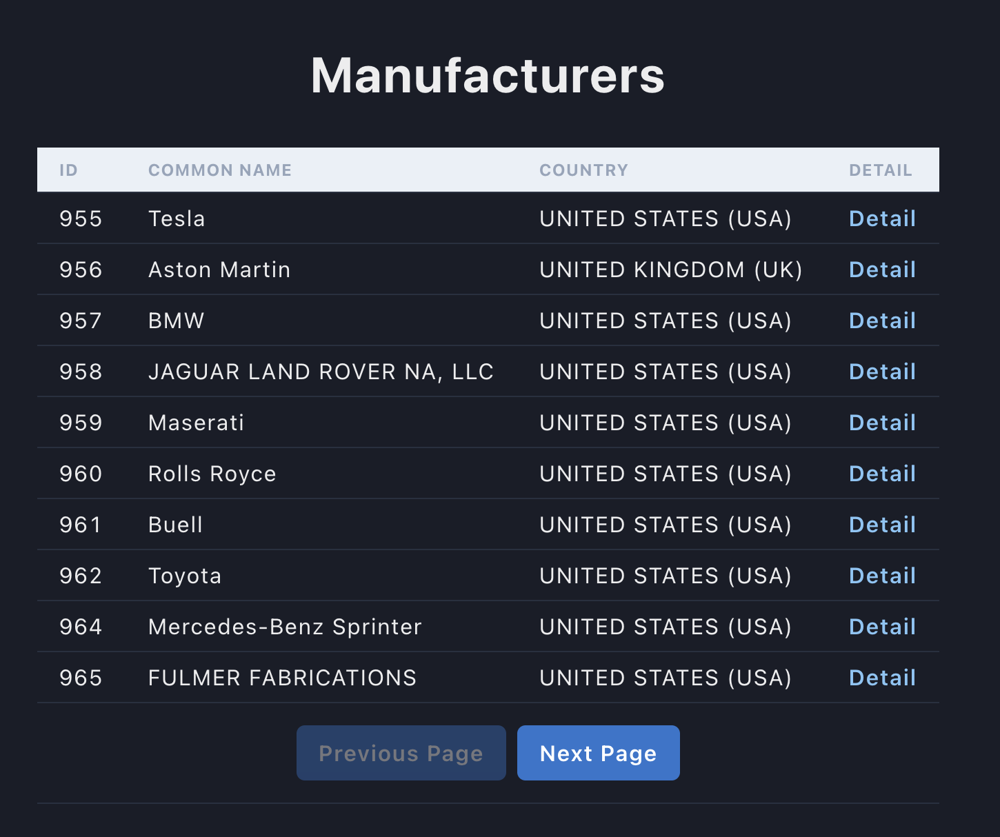

# Car Manufacturers Table Component



> A Nextjs project with a component to list all car manufacturers

### Main Features

The project should attend some features:

#### Main Features

- [x] List all manufacturers
- [x] Next page
- [x] Previous Page
- [x] Detail of manufacturers with models based on manufacturer

## 🚀 Installing <Project>

To install <Project>, follow this steps:

Linux and macOS:

Create a .env in the root of the app with this content:

```
NEXT_PUBLIC_API_URL=https://vpic.nhtsa.dot.gov/api
NEXT_PUBLIC_BASE_URL=http://localhost:3000
```

```
yarn or npm i
yarn dev
```

## 🤝 Collaborator

This is the main developer working on this project:

<table>
  <tr>
    <td align="center">
      <a href="#">
        <br>
        <sub>
          <b>Christopher Correa</b>
        </sub>
      </a>
    </td>
  </tr>
</table>
